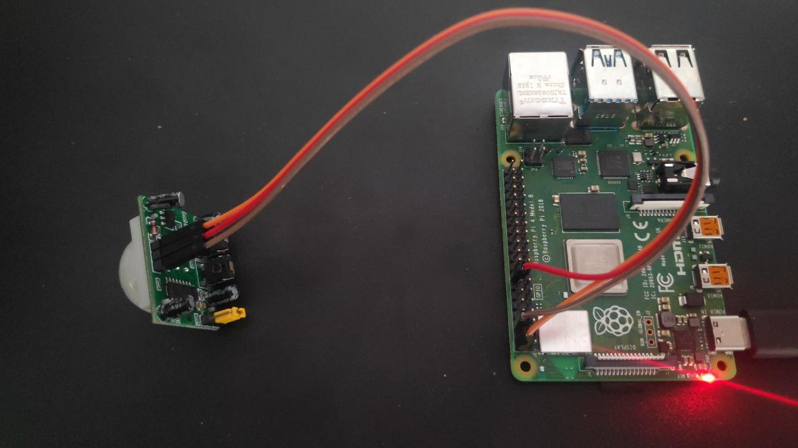
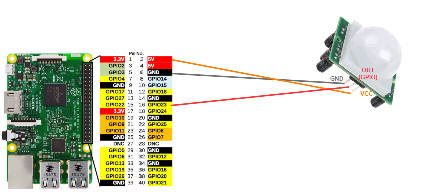
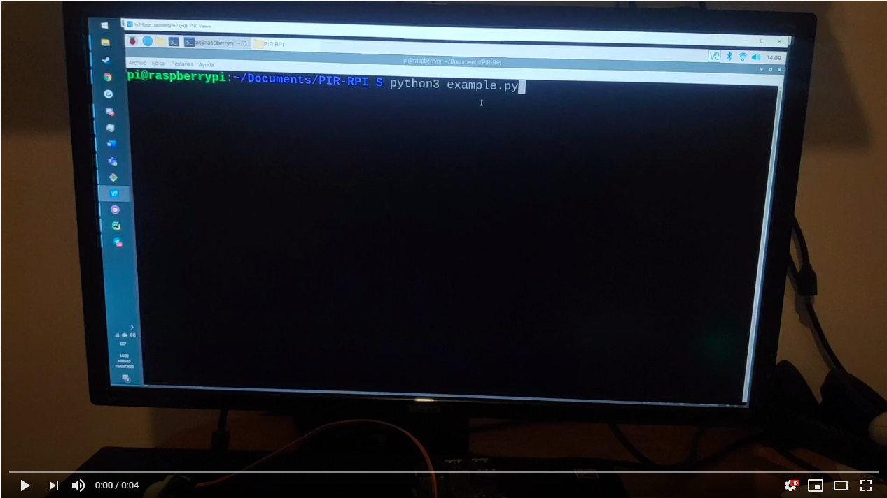

# PIR sensor controller for Raspberry Pi

This is a python library to manage a PIR sensor.



## Features
    - Config
        - Configure the GPIO pin
        - Configure the time-lapse of detecting
        - Configure the performing action
    - Perform an action when the PIR sensor detects movement
    - Automatize trigger actions when the PIR sensor dectects movement
        - Start the process
        - Stop the process

## Example

Throughout this section we will use a real example, using the GPIO pin 23 and a dummy function.


### Pin connections



### Code under Raspberry Pi

```python
from rpi_pir import PIR


# Action to perform when the PIR detects something
def dummy_function(name):
    print("I have detected ".format(name))


# Arguments for the action
args = ('Juan',)

# Instantiate the class
sensor = PIR(gpio_pin=23, time_lapse=1, action=dummy_function, action_args=args)

# Monitoring for just one action
sensor.one_action()# Continuous monitoring
# sensor.start()
# Stop continuous monitoring
# sensor.stop()
```

### Demo

[](https://youtu.be/jXFF8hR0uW8)